# 🏡 MERN Estate Project

A full-stack **real estate marketplace application** built with the **MERN stack** and **Appwrite for file storage**, allowing users to register, create listings with images, manage profiles, and explore property listings.  

---

## 📌 Project Overview

MERN Estate is a **real estate management system** for buyers and sellers, offering the ability to:

- Register/Login securely with JWT authentication.
- Create, edit, and delete property listings.
- Upload multiple images per listing (first image is the cover).
- Update profile information and avatar.
- Filter properties based on type, offer, price, and location.

**Tech Stack:**

- **Frontend:** React, Redux, TailwindCSS, Vite
- **Backend:** Node.js, Express.js, MongoDB, Mongoose
- **Storage:** Appwrite (File uploads)
- **Authentication:** JWT
- **File Handling:** Multer (backend)
- **Environment Management:** dotenv

---

## 🎯 Functionality

### User Features:

- **Sign Up / Login:** JWT-based secure authentication.
- **Profile Management:** Update avatar, username, email, password.
- **Listings:** Create new property listings with multiple images.
- **Image Upload:** Upload images to Appwrite storage with public view access.
- **Validation:** Frontend validations (required fields, min/max lengths).
- **Responsive Design:** Works on mobile and desktop.

### Admin / Backend Features:

- **REST API Endpoints:**
  - `POST /api/auth/login` – Login user
  - `POST /api/auth/signup` – Register user
  - `GET /api/user/:id` – Get user profile
  - `PUT /api/user/:id` – Update profile
  - `POST /api/upload` – Upload images to Appwrite
- **Database Integration:** MongoDB for user and listing data.
- **File Upload:** Appwrite storage integrated with Multer.
- **CORS Setup:** Frontend-backend communication handled.
- **Error Handling:** Centralized middleware for consistent error responses.

---

## 🖼 Screenshots

🏡 Home Page

 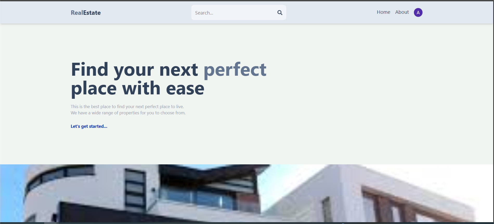 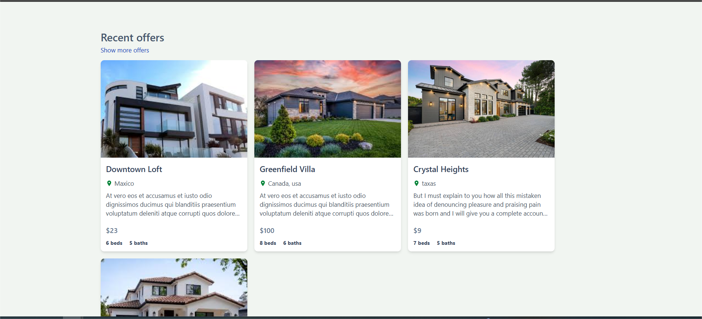 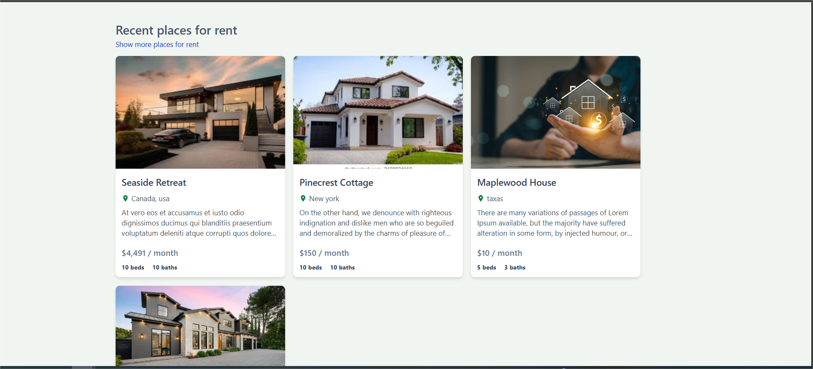 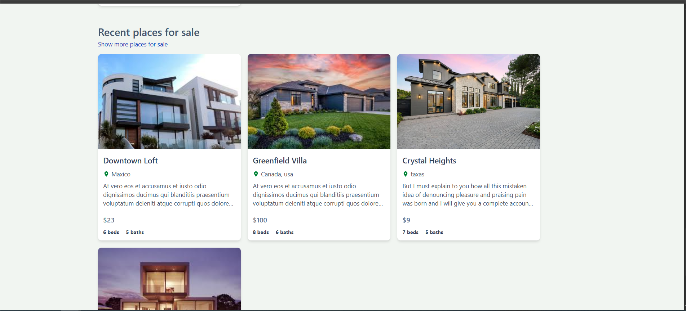 
 
 <em>Responsive home page showcasing featured listings and navigation.</em> 

🏠 Create Listing

 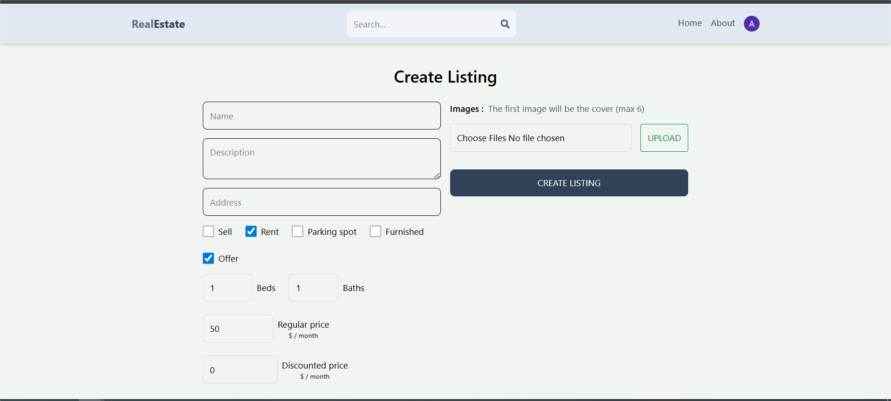 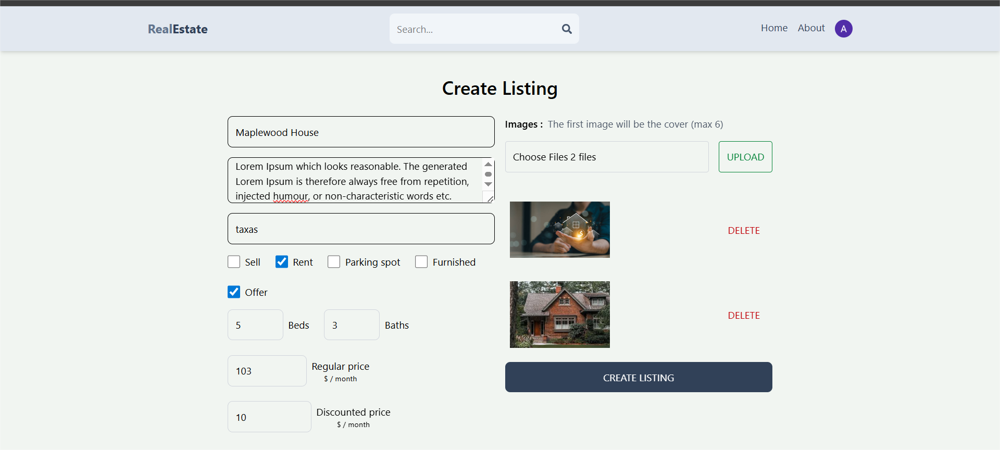 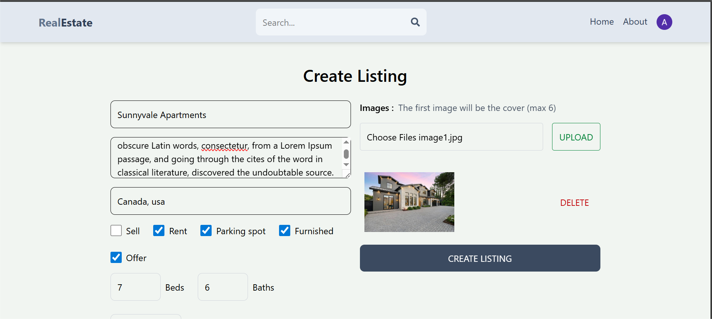 
 
 <em>Step-by-step listing creation with image uploads, pricing, and property details.</em> 

📋 Listings Page

 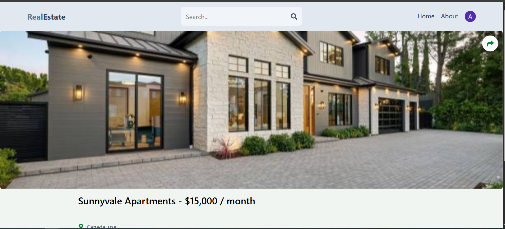 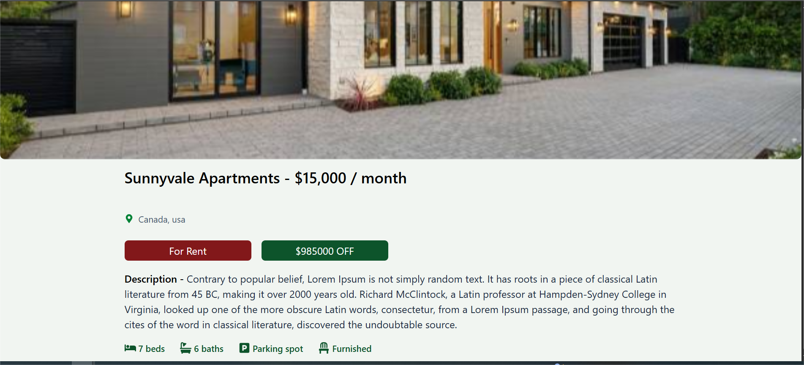 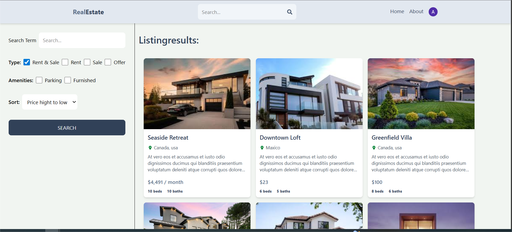 
 
 <em>Dynamic property listings fetched from MongoDB with images stored on Appwrite.</em> 

🧾 Search Listing Page

  
 
 <em> Allowing users to search listing based on rent, sale, offer, furnished, parking, discount price, regular price, latest and oldest . </em> 

🧑 Profile Page

 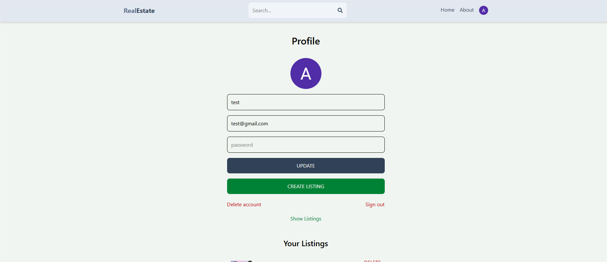 
 
 <em> User profile page allowing users to view and update their personal information, including profile image upload using Appwrite Storage. Authentication state is managed via Redux and JWT. </em> 

ℹ️ About Page

 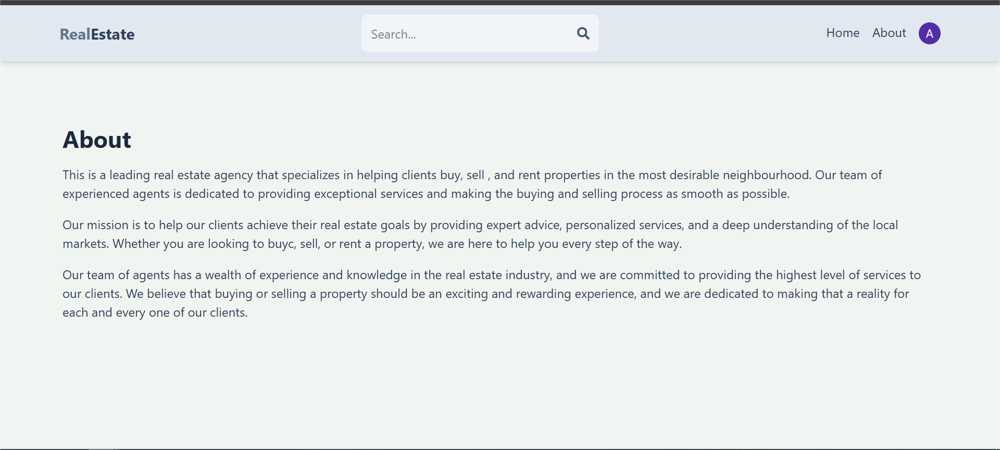 
 
 <em> Informational page describing the purpose of the platform, its features, and overall vision. Built as a static React component with a clean and responsive layout. </em> 

---

## 🗂 Project Structure

### Backend (`api/`)

api/
├─ index.js # Entry point, server & CORS setup
├─ routes/
│ ├─ auth.route.js # Authentication routes
│ ├─ user.route.js # User CRUD routes
│ └─ upload.route.js # File upload route
├─ models/
│ ├─ User.js # User schema
│ └─ Listing.js # Listing schema
├─ utils/
│ └─ appwrite.js # Appwrite client setup
├─ .env # Environment variables

**Key Features Implemented:**

- MongoDB connection using Mongoose
- JWT authentication
- File upload with Appwrite & Multer
- CORS enabled for frontend communication
- Centralized error handling

### Frontend (`client/`)

client/
├─ src/
│ ├─ pages/
│ │ ├─ Profile.jsx # Profile page with avatar upload
│ │ └─ CreateListing.jsx # Create listing form
│ ├─ redux/ # Redux store for user state
│ ├─ App.jsx # Main App component
│ └─ main.jsx # React DOM render
├─ package.json
├─ tailwind.config.js
└─ vite.config.js

**Frontend Features:**

- Form validation with HTML5 and custom logic
- Image preview & upload
- Fetch API for REST calls to backend
- Responsive design with TailwindCSS

🛠 Debugging / Notes

Extensive use of console logs to track backend API flow and Appwrite file uploads.

CORS issues resolved using cors middleware on backend.

Solved Appwrite file upload issue: File not found in payload by wrapping buffer with Uint8Array.

Frontend uses FormData and fetch for uploading images.

Hidden file input with styled button for better UX.

📚 What I Learned

Setting up MERN stack with structured folders.

JWT-based authentication & authorization.

Integrating Appwrite for secure file storage.

Handling multipart form data with Multer.

Using React + Redux for state management.

Debugging CORS and API call issues.

Managing environment variables securely with dotenv.

Styling with TailwindCSS for responsive design.

✅ Planned Features

Display uploaded images in listings with carousel.

Real-time upload progress on frontend.

Filter and search listings by type, price, and location.

User dashboard to manage listings.

Full CRUD operations for listings.

Better error handling & notifications on frontend.
